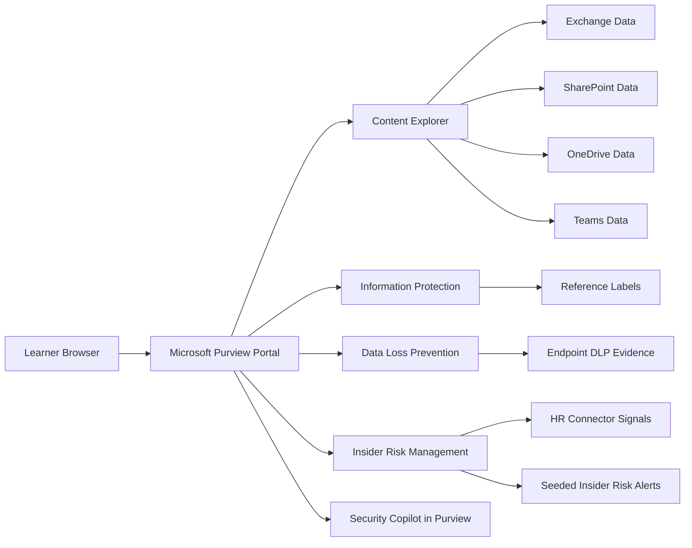

# Know Your Data - Discover, Classify and Protect Sensitive Information with Microsoft Purview

### Estimated Duration: 20 Minutes

## Scenario

Zava has asked you to act as a compliance and information protection practitioner in a pre-provisioned Microsoft 365 E5 demo tenant. Instead of waiting for data crawling, policy propagation, or alert generation, you will work with pre-seeded Microsoft 365 content and pre-warmed Microsoft Purview signals to discover sensitive information, compare protection strategies, reduce oversharing risk, and investigate insider activity.

## Lab Overview

This lab is a challenge-based experience made up of four progressive challenges. You will first review discovery evidence that already exists in the tenant, then create Zava-specific sensitivity labels and publishing controls, build DLP policies aligned to the reference design, and finally investigate insider risk alerts with Security Copilot in Purview. The lab deploys no Azure resources and uses only the provided Microsoft 365 and Microsoft Purview environment.

## Objectives

1. Review pre-indexed Content Explorer evidence across Exchange, SharePoint, OneDrive, and Teams.
2. Create and compare Zava-specific sensitivity labels and an auto-labelling policy in simulation mode.
3. Configure DLP policies to reduce external sharing risk and generative AI app exposure.
4. Investigate pre-seeded insider risk alerts and summarize findings with Security Copilot in Purview.

## Prerequisites

1. Use a supported desktop browser and ensure pop-ups or downloads are not blocked for Microsoft 365 and Microsoft Purview.
2. Sign in with an account that has the Compliance Administrator role and both Content Explorer List Viewer and Content Explorer Content Viewer permissions.
3. Be prepared to work only with the pre-seeded tenant data and signals provided in the lab.
4. Do not wait for new indexing, policy propagation, or alert generation unless a challenge explicitly asks you to review simulation output that already exists.

## Sign-in

1. Open <https://purview.microsoft.com/> and sign in with Username: <inject key="AzureAdUserEmail"></inject> and Password: <inject key="AzureAdUserPassword"></inject>.
2. Confirm that you can access Microsoft Purview and that the tenant already contains discovery, labeling, DLP, and insider risk evidence for the challenges in this lab.
3. Keep your deployment reference available as **Deployment ID: <inject key="DeploymentID" enableCopy="false"/>** in case your lab operator asks you to confirm the active environment.

## Architecture

This lab uses a browser-based Microsoft 365 tenant with Microsoft Purview already configured and populated for challenge execution.

## Components

1. **Microsoft 365 E5 demo tenant** provides the Microsoft 365 workloads and permissions context used throughout the lab.
2. **Microsoft Purview Content Explorer** contains pre-indexed results for Exchange, SharePoint, OneDrive, and Teams so you can analyze sensitive data immediately.
3. **Seeded sensitive data** includes credit card numbers, U.S. Social Security numbers, IBANs, and health-related content used for discovery and policy testing.
4. **Pre-published reference sensitivity labels** act as the comparison baseline for the Zava labels you will create.
5. **Completed reference auto-labelling simulation** provides existing simulation evidence so you can review results without waiting for a fresh run.
6. **Endpoint DLP evidence** includes an onboarded environment and at least one blocked upload event relevant to device-scoped controls.
7. **Mock HR connector data and seeded insider risk alerts** support the departing-user investigation scenario.
8. **Security Copilot in Purview** helps summarize discovery findings and insider risk evidence during the challenges.

## Challenge Map

1. **Challenge 1: Discover sensitive data across the Microsoft 365 estate** focuses on reviewing Content Explorer evidence, exporting summary findings, and using Security Copilot in Purview to summarize unlabelled sensitive content risk.
2. **Challenge 2: Classify data with sensitivity labels and auto-labelling** focuses on creating four exact Zava labels, publishing them, and configuring an auto-labelling policy in simulation mode.
3. **Challenge 3: Prevent oversharing with Data Loss Prevention** focuses on creating two exact DLP policies, including a device-scoped policy that uses the built-in Generative AI Websites sensitive service domain group.
4. **Challenge 4: Detect and investigate insider risk with Security Copilot** focuses on configuring a departing-user insider risk policy and analyzing seeded alerts with Security Copilot in Purview.

## What to expect

1. You will use challenge outcomes and reporting evidence rather than waiting for background processing to complete during the lab window.
2. You will compare your Zava configurations against a pre-existing tenant baseline instead of replacing or deleting the reference setup.
3. You will validate Challenge 2 and Challenge 3 through configuration checks, while Challenge 1 and Challenge 4 are assessed through evidence review and reasoning.
4. You should keep notes as you progress because several challenges require you to capture summary findings and compare observed risk signals.

## After publishing

> [!Note] These steps run **after** you push the template to CloudLabs — they verify CloudLabs can actually serve this lab guide to candidates.

- **Verify docs-proxy access:** open Templates → your template → **Lab Guide Settings** in <https://admin.cloudlabs.ai> and confirm CloudLabs can reach this repo via the docs proxy. If the repo is private, configure GitHub access at the template level.
- **Verify inline questions and inline validations:** sign in to <https://admin.cloudlabs.ai>, open your template, and walk through one full lab run to confirm every `<question>` and `<validation step="..."/>` renders correctly. Fix any that don't resolve.
